 

---

## About Me

I'm **Faletehan Al Farabi**, a **Software Engineering (RPL) student at SMK Taruna Bhakti**.
I build **modern, responsive, and user-centered web applications** and learn best by turning ideas into real projects.

- **Current focus:** Full-Stack Web Development with **React, Next.js and TypeScript**
- **Currently learning:** Backend Architecture, UI/UX Design, and AI Integration
- **Goal:** To become a **professional Software Engineer** who builds impactful products
- **Contact:** **faletehanalfarabi09@gmail.com** — open to collaboration, internships, and learning opportunities

---

## Tech Stack

---

## GitHub Analytics

 

---

## Contribution Arcade

Consistency is the game. Every commit is progress.

<picture>
  <source media="(prefers-color-scheme: dark)" srcset="https://raw.githubusercontent.com/FaletehanAlF/FaletehanAlF/output/galaga-contribution-graph-dark.svg">
  <source media="(prefers-color-scheme: light)" srcset="https://raw.githubusercontent.com/FaletehanAlF/FaletehanAlF/output/galaga-contribution-graph.svg">
  
</picture>

---

## Let's Connect

I'm always open to interesting projects, collaborations, internships, and learning opportunities.

 

  

